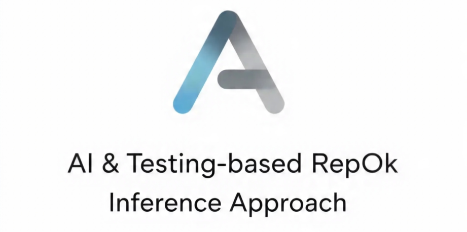

## Thesis pdf
[Document](tesis.pdf)

## Steps for tool setup

1. Clone the repository with its submodules
```bash
git clone --recurse-submodules https://github.com/ValenButtignol/repok-generator-tool.git atria
```

2. Make sure having installed Java 21 and Gradle 8.12.

3. Download [Miniconda](https://docs.anaconda.com/miniconda/).

4. Create and activate an environment with Miniconda:
```
conda create -n <env-name>
conda activate <env-name>
```

5. Execute [dependencies.sh](dependencies.sh) to install the required dependencies.
```bash
bash dependencies.sh
```

6. Install any model supported by [llama-cpp-python](https://github.com/abetlen/llama-cpp-python). For more details [README.md](tools/llm-repok-generator/README.md) file.
```
wget -P tools/llm-repok-generator/models <model_download_url>
```

> NOTE: Make sure of adding the model name to the [ModelPathFactory](tools/llm-repok-generator/classes/factories/model_path_factory.py) file. In this file are the model_paths and model_names of the models that we used to test the tool. The download links are in the [README.md](tools/llm-repok-generator/README.md) file.

### Execute program
```
gradle run --args="<modelName> <classPath> <className> <promptType>"
```

> NOTE: The `modelName` is the name of the model captured by the [ModelPathFactory](tools/llm-repok-generator/classes/factories/model_path_factory.py) If you want to test another model, you can add another option to this factory. 
> The `classPath` is the path to the class file. The `className` is the name of the class.
> The `promptType`is the style of prompt to use for the LLM. More details in [README.md](tools/llm-repok-generator/README.md)
